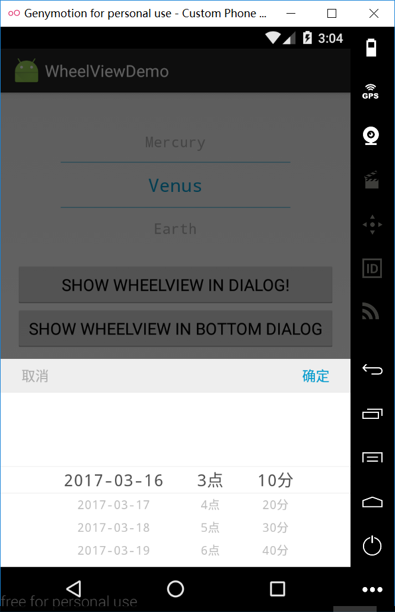
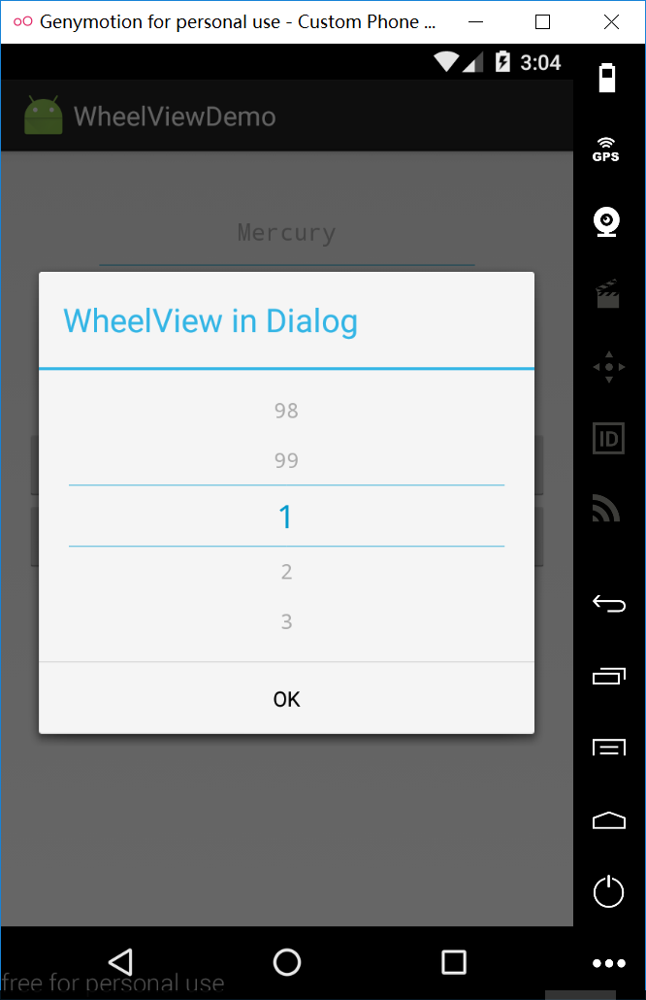
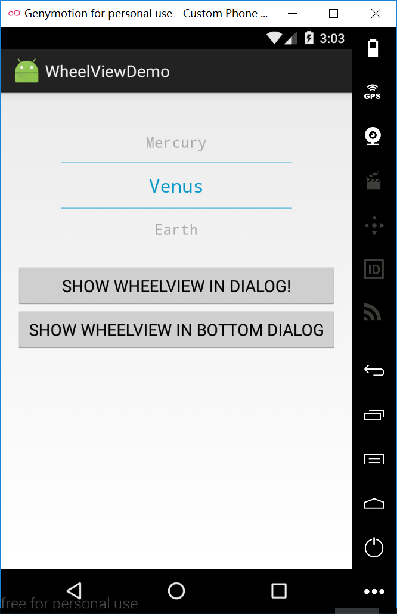

# WheelView
a great functional custom WheelView with demo in dialog and bottomDialog,android 滚动选择控件,滚动选择器

=========






# Attributes

There are several attributes you can set:

| attr 属性          | description 描述 |
|:---				 |:---|
| lineColor  	     | divider line color 分割线颜色 |
| itemVisibleNum	 	 | wheelview show item count 此wheelView显示item的个数 |
| textColorOuter 	 | unSelected Text color 未选中文本颜色 |
| textSizeOuter 	 | unSelected Text size 未选中文本字体大小 |
| textColorCenter    | selected Text color 选中文本颜色 |
| textSizeCenter 	 | selected Text size 选中文本字体大小 |
| isLoop        	 | isLoop or no 滚轮是否首尾相连 |
| lineSpaceingDimens | item unit margin height 每个item单元格中文字距离上下的高度 |
| wheelGravity       | align direction:left;center;right 对齐方向：靠左对齐 居中 靠右对齐|

# Method

### 1. setItems(List<String> items, int initPosition)

set WheelView items and init selected position</br> 
设置WheelView的数据和初始位置

### 2. setOnItemSelectedListener(OnItemSelectedListener OnItemSelectedListener)

set listener on WheelView that can get info when WheelView changed selected item.</br>
对WheelView设置监听器，当WheelView 选中项改变时返回选中项的索引和值。

### How to use

#### layout: 
```xml
    <wheelview.WheelView
        android:id="@+id/wheel_view"
        android:layout_width="match_parent"
        android:layout_height="wrap_content"
        android:layout_marginLeft="50dp"
        android:layout_marginRight="50dp"
        app:textColorCenter="@android:color/holo_blue_dark"
        app:lineSpaceingDimens="15dp"
        app:itemVisibleNum="3"
        app:lineColor="@android:color/holo_blue_dark"
        app:textSizeCenter="20dp"
        app:textSizeOuter="16dp"
        app:isLoop="false"
        app:textColorOuter="@android:color/darker_gray"
        />
```

#### Activity: 

```java    
WheelView wva = (WheelView) findViewById(R.id.wheel_view);
wva.setItems(Arrays.asList(PLANETS),1);//init selected position is 1 初始选中位置为1
wva.setOnItemSelectedListener(new WheelView.OnItemSelectedListener() {
	@Override
	public void onItemSelected(int selectedIndex, String item) {
		Log.d(TAG, "selectedIndex: " + selectedIndex + ", item: " + item);
	}
});
```

#### Show in dialog: 

```java
View outerView = LayoutInflater.from(this).inflate(R.layout.dialog_content_view, null);
final WheelView wv = (WheelView) outerView.findViewById(R.id.wheel_view_wv);
wv.setItems(getNumbers(),0);//init selected position is 0 初始选中位置为0
wv.setOnItemSelectedListener(new WheelView.OnItemSelectedListener() {
	@Override
	public void onItemSelected(int selectedIndex, String item) {
		Log.d(TAG, "[Dialog]selectedIndex: " + selectedIndex + ", item: " + item);
	}
});

new AlertDialog.Builder(this)
		.setTitle("WheelView in Dialog")
		.setView(outerView)
		.setPositiveButton("OK", new DialogInterface.OnClickListener() {
			@Override
			public void onClick(DialogInterface dialog, int which) {
				Toast.makeText(MainActivity.this,
						"selectedIndex: "+ wv.getSelectedPosition() +"  selectedItem: "+ wv.getSelectedItem(),
						Toast.LENGTH_SHORT).show();
			}
		})
		.show();
```

#### Show in a bottomDialog: 

```java    
View outerView1 = LayoutInflater.from(this).inflate(R.layout.dialog_select_date_time, null);
//日期滚轮
final WheelView wv1 = (WheelView) outerView1.findViewById(R.id.wv1);
//小时滚轮
final WheelView wv2 = (WheelView) outerView1.findViewById(R.id.wv2);
//分钟滚轮
final WheelView wv3 = (WheelView) outerView1.findViewById(R.id.wv3);

final TimeRange timeRange = getTimeRange();
wv1.setItems(Common.buildDays(timeRange),0);
wv2.setItems(Common.buildHourListStart(timeRange),0);
wv3.setItems(Common.buildMinuteListStart(timeRange),0);

//联动逻辑效果
wv1.setOnItemSelectedListener(new WheelView.OnItemSelectedListener() {
	@Override
	public void onItemSelected(int index,String item) {
		List hourStrList = Common.buildHoursByDay(wv1, timeRange);
		int newIndexHour = hourStrList.indexOf(wv2.getSelectedItem());
		wv2.setItems(hourStrList,newIndexHour);
		List minStrList = Common.buildMinutesByDayHour(wv1, wv2, timeRange);
		int newIndexMin = minStrList.indexOf(wv3.getSelectedItem());
		wv3.setItems(minStrList,newIndexMin);
	}
});
wv2.setOnItemSelectedListener(new WheelView.OnItemSelectedListener() {
	@Override
	public void onItemSelected(int index,String item) {
		List minStrList = Common.buildMinutesByDayHour(wv1, wv2, timeRange);
		int newIndexMin = minStrList.indexOf(wv3.getSelectedItem());
		wv3.setItems(minStrList,newIndexMin);
	}
});

TextView tv_ok = (TextView) outerView1.findViewById(R.id.tv_ok);
TextView tv_cancel = (TextView) outerView1.findViewById(R.id.tv_cancel);
//点击确定
tv_ok.setOnClickListener(new View.OnClickListener() {
	@Override
	public void onClick(View arg0) {
		bottomDialog.dismiss();
		String selectDateTimeStrToShow;
		String mSelectDate = wv1.getSelectedItem();
		String mSelectHour = wv2.getSelectedItem();
		String mSelectMin = wv3.getSelectedItem();
		String time = mSelectHour + mSelectMin;
		time = Common.timeToStr(Common.dateTimeFromCustomStr( mSelectDate, time));
		selectDateTimeStrToShow = mSelectDate + "  " + time;
		Toast.makeText(MainActivity.this, "selectDateTime: "+selectDateTimeStrToShow, Toast.LENGTH_SHORT).show();
	}
});
//点击取消
tv_cancel.setOnClickListener(new View.OnClickListener() {
	@Override
	public void onClick(View arg0) {
		bottomDialog.dismiss();
	}
});
//防止弹出两个窗口
if (bottomDialog !=null && bottomDialog.isShowing()) {
	return;
}

bottomDialog = new BottomDialog(this, R.style.ActionSheetDialogStyle);
//将布局设置给Dialog
bottomDialog.setContentView(outerView1);
bottomDialog.show();//显示对话框
```
